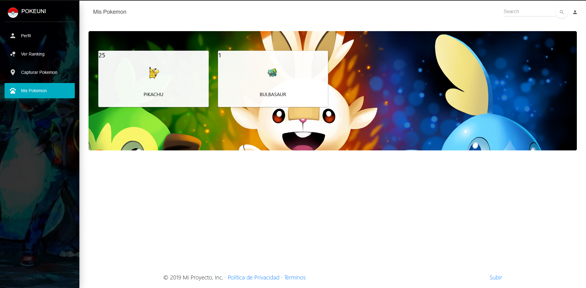

# Documentación de nuestra App en React
- Instalar nodejs.

- En una consola de windows, terminal de linux o Powershell correr el comando **npm install** para           instalar todas las dependencias del proyecto.

- Correr el comando **npm start** con el cual levantará un servidor de desarrollo en http://localhost:3000   donde correremos la aplicación.

- Estructura del proyecto
~~~
src
   |   index.js
   |   
   +---assets
   |   +---css
   |   |       bootstrap.min.css
   |   |       bootstrap.min.css.map
   |   |       mi.css   
   |   +---demo
   |   |       demo.css
   |   |       nucleo-icons-page-styles.css
   |   |         
   |   +---img
   |   |       bg1.jpg
   |   |       bg3.jpg
   |   |       bg4.jpg
   |   |       bg5.jpg
   |   |       bg6.jpg
   |   |       bg7.jpg
   |   |       bg8.jpg
   |   |       fondohd.png
   |   |       header1.jpg
   |   |       header3.jpg
   |   |       header5.jpg
   |   |       hero-image-1.png
   |   |       hero-image-2.png
   |   |       hero-image-3.png
   |   |       login.jpg
   |   |       main.jpg
   |   |       perfil.png
   |   |       pokeball.svg
   |   |       pokeunilogo.png
   |   |       profile.jpg
   |   |       ryan.jpg
   |   |       sidebar-2.jpg  
   |   +---scss
   |   |   \---react
   |   |       |   react-differences.scss
   |   |       |   
   |   |       +---now-ui-kit
   |   |       |       _dropdowns.scss
   |   |       |       _misc.scss
   |   |       |       _modals.scss
   |   |       |       _popovers.scss
   |   |       |       _responsive.scss
   |   |       |       _sections.scss
   |   |       |       _typography.scss
   |   |       |       
   |   |       \---plugins
   |   |               _plugin-nouislider.scss
   |   |               _plugin-react-datetime.scss
   |   |                    
   +---components
   |   +---Footers
   |   |       DarkFooter.js
   |   |       TransparentFooter.js
   |   |       
   |   +---Grid
   |   |       GridContainer.js
   |   |       GridItem.js
   |   |       
   |   +---Headers
   |   |       IndexHeader.js
   |   |       LandingPageHeader.js
   |   |       ProfilePageHeader.js
   |   |       
   |   +---Navbars
   |   |       ExamplesNavbar.js
   |   |       IndexNavbar.js
   |   |       LoginNavbar.js
   |   |       
   |   \---Table
   |           Table.js
   |           
   +---juego
   |   |   Admin.js
   |   |   Perfil.js
   |   |   Ranking.js
   |   |   Ranking_service.js
   |   |   routes.js
   |   |   
   |   +---componentes
   |   |   |   HomePage.js
   |   |   |   
   |   |   +---CustomButtons
   |   |   |       Button.js
   |   |   |       CustomInput.js
   |   |   |       
   |   |   +---footer
   |   |   |       Footer.js
   |   |   |               
   |   |   +---juego
   |   |   |   |   Juego.js
   |   |   |   |   JuegoPage.js
   |   |   |   |   
   |   |   |   +---iconos
   |   |   |   |       lugia.jpg
   |   |   |   |       pikachu.jpg
   |   |   |   |       ratatta.jpg
   |   |   |   |       voulvas.jpg
   |   |   |   |       
   |   |   |   +---mapa
   |   |   |   |       Mapa.js
   |   |   |   |       ModalExample.js
   |   |   |   |       
   |   |   |   \---timer
   |   |   |           Timer.js
   |   |   |           
   |   |   +---menu
   |   |   |       Menu.js
   |   |   |       
   |   |   +---Navbars
   |   |   |       AdminNavbarLinks.js
   |   |   |       Navbar.js
   |   |   |       RTLNavbarLinks.js
   |   |   |       
   |   |   +---servicios
   |   |   |       Servicios.js
   |   |   |       
   |   |   \---Sidebar
   |   |           Sidebar.js
   |   |           
   |   \---Pokedex
   |       +---layout
   |       |       Dashboard.css
   |       |       Dashboard.js
   |       |       Loading.js
   |       |       NavBar.js
   |       |       spinner.gif
   |       |       
   |       +---pokemon
   |       |       Pokemon.js
   |       |       PokemonCard.js
   |       |       PokemonList.js
   |       |       
   |       \---search
   |               SearchBar.js
   |               
   +---login
   |   |   FormPage.css
   |   |   FormPage.js
   |   |   FormPageBase.js
   |   |   imagen.jpg
   |   |   
   |   \---__componentes
   |           AuthService.js
   |           PrivateRoute.js
   |           
   +---services
   |   |   background.css
   |   |   HomeContainer.js
   |   |   
   |   \---images
   |           fondohd.png
   |           main.jpg
   |           main2.jpg
   |           
   \---views
       |   Index.js
       |   NucleoIcons.js
       |   
       +---examples
       |       LandingPage.js
       |       LoginPage.js
       |       ProfilePage.js
       |       
       \---index-sections
               Download.js
               Navbars.js
~~~
En el index.js principal definimos las rutas tales como :
/index aca se carga el componente que se encuentra en views/Index.js
/game aca se carga el componente que se encuentra en juego/Admin.js
/login-page aca se carga el componente que se encuentra en views/LoginPage.js

Una vez nos logueados el encargado de manejar los componentes es Admin.js, nos va ir actualizando según si queremos ver perfil views/ProfilePage.js, ranking en Ranking en Ranking.js, pokedex en Pokedex/layout/Dashboard.js y juego en /componentes/juego/JuegoPage.js.

Asu vez estos llaman a componentes secundarios.

## 1. Página de inicio
Se nos mostrará la pagina de inicio o bienvenida donde podremos conocer más de la empresa a su vez nos llevará a la página de logeo al pulsar en login. 

En "Contactanos" nuestra información más detallada de la empresa.

## 2. Login
Una vez creado la empresa y los trabajadores de esta, podemos logearnos de manera sencilla con nuestro nombre de usuario, nuestra contraseña y el nombre de la empresa. Lo que internamente se hara es una consulta Post al backend donde se envia un JSON con datos escritos en el formulario. El Backend nos generara un JSON de respuesta que contara con un estatus que nos permitira acceder a nuestro perfil de usuario.

## 3. Perfil

Ingresas a esta página automaticamente después de haberte logeado de manera correcta, luego siempre habra un link disponible en la parte izquierda. Aquí puedes revisar tus estadisticas básicas como jugador: tu nombre, tu foto de perfil, tu puntaje, cantidad de pokemones(mas detalles en pokedex) y puesto en el ranking. Todos estos datos vienen como respuesta a un **POST** que se envia durante el login que da como respuesta un **JSON** con la información necesaria del usuario.

## 4. Juego/Mapa/Captura
A esta página se llega por la opción Capturar Pokemon, aquí el navegador te pedirá acceso a tu ubicación para poder jugar y ver los pokemon en el mapa.

Para capturar el pokemon solo hace falta hacerle un click y se mostrará una pregunta con respuestas de opción multiple.

De haber contestado exitosamente se mostrará un mensaje de Felicitaciones

en caso contrario deberá esperar 5 segundos para recuperarse y seguir capturando pokemons.

## 5. Ranking
El Ranking nos muestra una lista ordenada de todos los participantes según sea la empresa. Todos estos datos vienen como respuesta a un **POST** que se envia el nombre de la empresa, que da como respuesta un **JSON** con la información necesaria de todos los usuarios.

## 6. Pokedex

El pokedex consiste en dos ventanas dentro del proyecto que sirven para:

1. ver cuales pokemones ha capturado el usuario hasta el momento.
   
2. Para ver las estadisticas de cada uno de esos pokemones(mas que todo como insentivo ya que a los jugadores siempre le gustan las estadisticas).
   

El pokedex toma la información recibida en el **JSON** del login.
