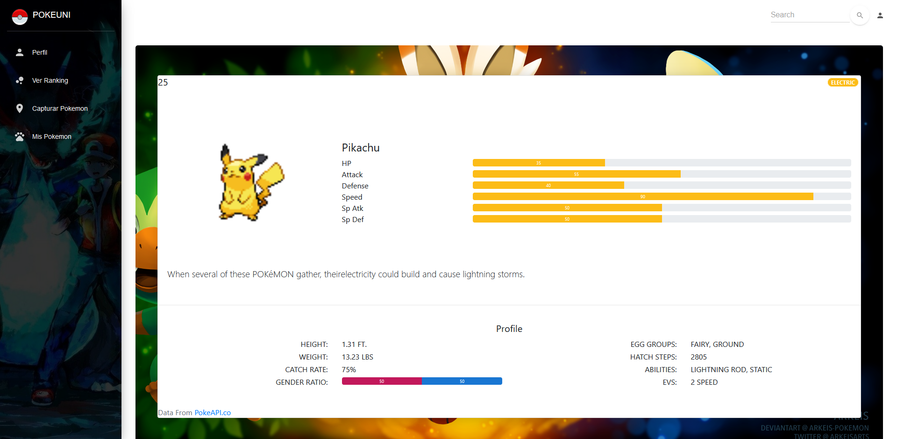

# Documentación de nuestra App en React

## 1. Página de inicio

## 2. Login
Una vez creado la empresa y los trabajadores de esta, podemos logearnos de manera sencilla con nuestro nombre de usuario, nuestra contraseña y el nombre de la empresa. 

## 3. Perfil

Ingresas a esta página automaticamente después de haberte logeado de manera correcta, luego siempre habra un link disponible en la parte izquierda. Aquí puedes revisar tus estadisticas básicas como jugador: tu nombre, tu foto de perfil, tu puntaje, cantidad de pokemones(mas detalles en pokedex) y puesto en el ranking. Todos estos datos vienen como respuesta a un **POST** que se envia durante el login que da como respuesta un **JSON** con la información necesaria del usuario.

## 4. Juego/Mapa/Captura

## 5. Ranking

## 6. Pokedex

El pokedex consiste en dos ventanas dentro del proyecto que sirven para:

1. ver cuales pokemones ha capturado el usuario hasta el momento.
   
2. Para ver las estadisticas de cada uno de esos pokemones(mas que todo como insentivo ya que a los jugadores siempre le gustan las estadisticas).
   

El pokedex toma la información recibida en el **JSON** del login.
